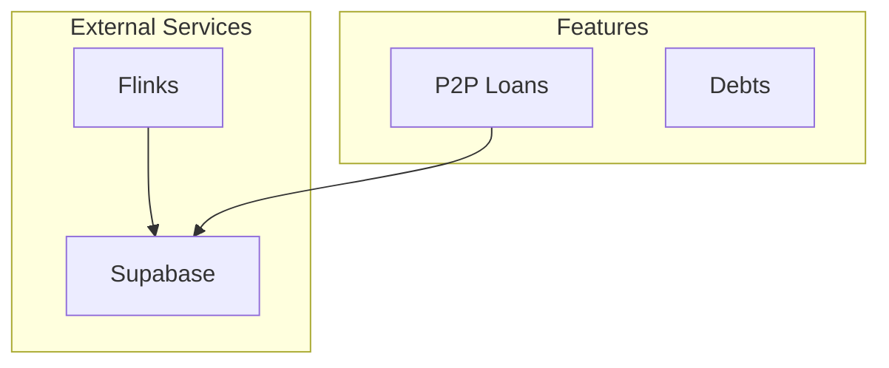

# Codebase Architecture Mapper

This skill scans entire codebases, identifies all systems/features, maps their relationships, and generates organized architecture documentation.

## Instructions

### Step 1: Scan the Codebase

Recursively scan all files in the project:

```bash
python scripts/scan-codebase.py /path/to/project > scan-results.json
```

**What this does:**
- Walks through all directories (skips node_modules, .git, etc.)
- Extracts imports from each file
- Counts lines of code
- Builds a complete file tree

### Step 2: Identify Systems

Group files into logical systems:

```bash
python scripts/identify-systems.py scan-results.json > systems.json
```

**How it detects systems:**
- Directory patterns: `src/flinks/` → Flinks System
- File names: `*classification*` → Classifications System
- Import patterns: `@supabase/*` → Supabase System

**Systems it finds automatically:**
- Flinks (bank integration)
- Supabase (database)
- P2P (peer-to-peer loans)
- Classifications (categories)
- Auth (authentication)
- Dashboard (main UI)
- Debts (debt tracking)
- Income (earnings)
- API (routes)
- UI (components)
- Utils (helpers)

### Step 3: Generate Documentation

Create markdown docs for each system:

```bash
python scripts/generate-docs.py systems.json docs/architecture
```

**Creates:**
```
docs/architecture/
├── OVERVIEW.md          # High-level system map
├── systems/
│   ├── flinks.md        # Flinks documentation
│   ├── supabase.md      # Database layer
│   ├── p2p.md           # P2P loans
│   └── ...
└── diagrams/
    └── (generated by Step 4)
```

### Step 4: Generate Diagrams

Create Mermaid diagrams showing relationships:

```bash
python scripts/generate-diagrams.py systems.json docs/architecture/diagrams
```

**Creates:**
- `system-overview.mmd` - All systems with connections
- `data-flow.mmd` - How data moves through systems
- `dependency-map.mmd` - What depends on what

### Full Pipeline (One Command)

Chain all steps together:

```bash
cd /path/to/project
python scan-codebase.py . | python identify-systems.py - > systems.json
python generate-docs.py systems.json docs/architecture
python generate-diagrams.py systems.json docs/architecture/diagrams
```

## Methodology

### System Detection Algorithm

1. **Directory Affinity** (strongest signal):
   - Files in `src/flinks/` → 100% Flinks
   - Weight: 3 points

2. **Filename Patterns** (strong signal):
   - File named `classification.ts` → Classifications
   - Weight: 2 points

3. **Import Analysis** (supporting signal):
   - Imports from `@supabase/supabase-js` → Supabase
   - Weight: 1 point

4. **Threshold**: 2+ points = assigned to system

### Relationship Mapping

- **depends_on**: System A imports from System B
- **imported_by**: System B is used by System A
- Cross-referenced for bidirectional awareness

## Output Examples

### OVERVIEW.md Excerpt

```markdown
## System Map


```

### System Doc Excerpt

```markdown
# P2P System

## Statistics
| Files | 18 |
| Lines | 2,340 |

## Dependencies
**Depends On:** Supabase, Auth
**Used By:** Dashboard
```

## Advanced Usage

### Custom System Patterns

Edit `identify-systems.py` to add new patterns:

```python
SYSTEM_PATTERNS = {
    'my-custom-system': {
        'dirs': ['custom', 'my-feature'],
        'files': ['custom', 'myfeature'],
        'imports': ['@/custom'],
        'description': 'My custom system'
    }
}
```

### Limiting File Depth

For large monorepos:

```bash
# Only scan src/ directory
python scripts/scan-codebase.py ./src > scan-results.json
```

### Regenerating After Changes

Run the full pipeline again - it overwrites previous docs.

## Troubleshooting

### No systems detected
- Check that files have imports
- Verify directory structure matches patterns
- Run with `-v` for verbose output

### Missing files in scan
- Check SKIP_DIRS in scan-codebase.py
- Verify file extensions in CODE_EXTENSIONS

### Diagrams don't render
- Validate Mermaid syntax at mermaid.live
- Check for special characters in system names

## Notes

- Works best with JavaScript/TypeScript projects
- Supports Vue, React, Svelte, and vanilla JS
- Handles monorepos by scanning subdirectories
- Run monthly or after major refactors
